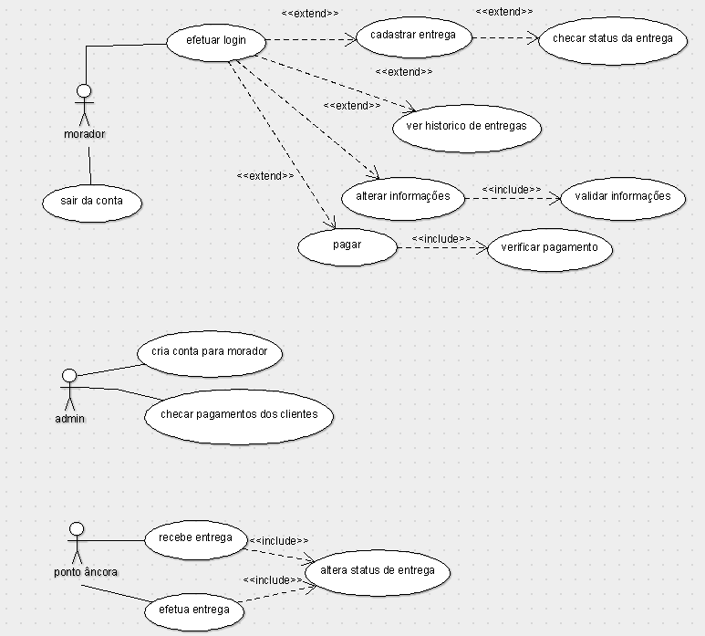

## Introdução

O diagrama de caso de uso é uma representação gráfica das interações entre os usuários(morador), admin, ponto âncora e o sistema. Ele descreve as funcionalidades esperadas do sistema sob o ponto de vista do usuário, permitindo uma visão geral dos requisitos funcionais e auxiliando na compreensão do comportamento do sistema.

## Metodologia

Para a criação da primeira versão do diagrama de caso de uso, a equipe utilizou o programa ArgoUML Além disso, foram utilizados o Discord e o WhatsApp para comunicação e o Visual Studio Code / Live Share para colaboração na documentação.

## Diagrama de Caso de Uso

### Versão 1.0

](../assets/Casos_de_Uso/DiagramaCasosDeUso.png)

<!-- #### Rastreabilidade de Requisitos

| ID|Descrição|
|---|---|
|US01|Realizar login|
|US02|Cadastrar entrega|
|US03|Visualizar status|
|US04|Gerenciar contas|
-->

## Conclusão

Com o diagrama de caso de uso, foi possível visualizar as interações dos usuários com o sistema de forma clara e organizada, facilitando a identificação dos requisitos funcionais. Ao longo do desenvolvimento do projeto, o diagrama será revisado e refinado para refletir novas funcionalidades e mudanças nos processos.

## Referências

> Use Case Diagrams. Disponível em: https://www.uml-diagrams.org/use-case-diagrams.html. Acesso em 06/05/25

> UML Use Case Diagram Tutorial. Disponível em: https://www.youtube.com/watch?v=OkCjC0Y1dxM. Acesso em 06/05/25

## Autor(es)

| Data | Versão | Descrição | Autor(es) |
| -- | -- | -- | -- |
| 06/05/25 | 1.0 | Criação do documento | Bernardo Lobo, Bernardo Moreira, Guilherme Dias, Julia Curto e Michel de Melo |
