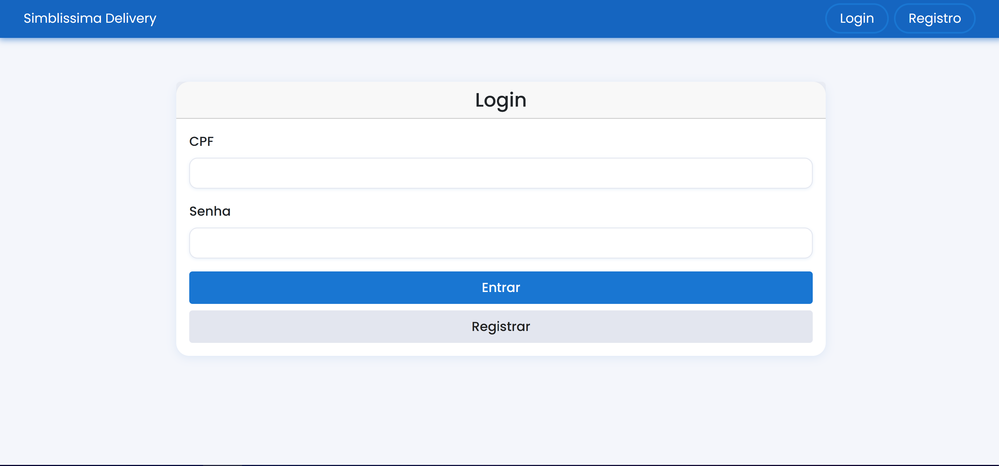
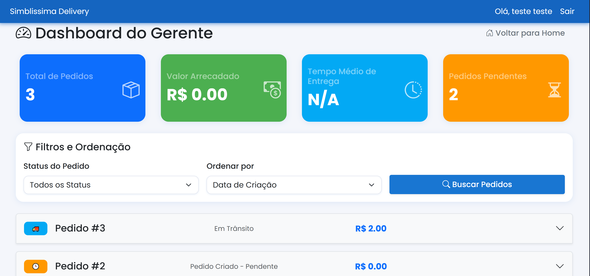
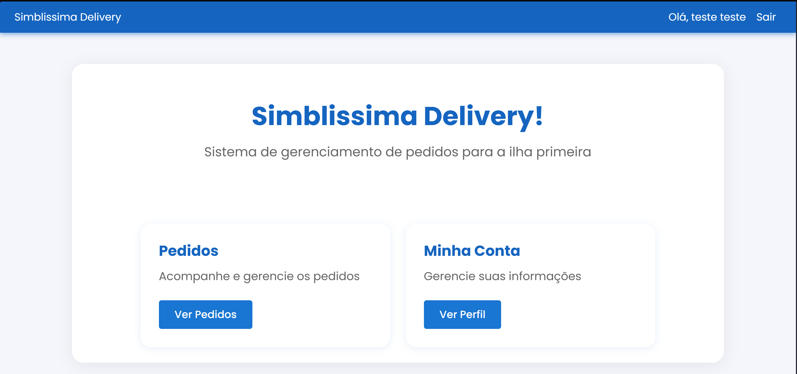

# Projeto Simblissima

**Número do Grupo**: 2<br>
**Código da Disciplina**: IBM-8936<br>

## Alunos
|Matrícula | Aluno |
| -- | -- |
| Bernardo Lobo Marques  |  202401709433  |
| Bernardo Moreira Guimarães Gonçalves  |  202401500283 |
| Guilherme Dias Batista | 202402972091 |
| Michel de Melo Guimarães | 202401569852 |
| Julia Dominguez Curto |  202402192477 |


## Sobre 
O projeto Simblissima é uma API REST com interface Single Page Application (SPA) para gerenciamento de pedidos e entregas entre o continente e a Ilha Primeira. O sistema permite que moradores da ilha criem pedidos de produtos, acompanhem o status em tempo real, e facilita a gestão logística através de um dashboard administrativo.

### Principais Funcionalidades:
- **Para Clientes**: Cadastro, login, criação de pedidos, acompanhamento de status, confirmação de valores
- **Para Gerentes**: Dashboard de gestão, atualização de status, definição de valores finais, filtros e estatísticas
- **Sistema**: API REST, autenticação por sessão, histórico de status, validações de dados

## Screenshots
[](assets/images/login.png)
*Tela de Login do Sistema*

[](assets/images/dashboard.png)
*Dashboard do Gerente*

[](assets/images/homeuser.png)
*Página inicial do Cliente*

## Instalação 
**Linguagens**: Python 3.12+<br>
**Tecnologias**: Django, Django REST Framework, SQLite, Bootstrap, JavaScript<br>

### Pré-requisitos:
- Python 3.12 ou superior
- pip (gerenciador de pacotes Python)

### Comandos de instalação:
```bash
# Clone o repositório
git clone <url-do-repositorio>
cd PBE_25.1_8001_II_Simblissima

# Instale as dependências
pip install -r requirements.txt

# Execute as migrações
python manage.py migrate

# Crie um superusuário (opcional)
python manage.py createsuperuser

# Execute o servidor
python manage.py runserver
```

## Uso 
Após executar o servidor com `python manage.py runserver`, acesse:

- **Interface Principal**: http://localhost:8000/
- **API REST**: http://localhost:8000/api/
- **Admin Django**: http://localhost:8000/admin/ (necessário superusuário)

### Fluxo de uso:
1. **Cliente**: Acesse a página inicial, registre-se ou faça login
2. **Criar Pedido**: Use a opção "Novo Pedido" para adicionar itens
3. **Acompanhar**: Visualize seus pedidos e status na área "Meus Pedidos"
4. **Gerente**: Use login de staff para acessar o dashboard de gestão

## Vídeo
Adicione 1 ou mais vídeos com a execução do projeto final.

## Outros 
Quaisquer outras informações sobre seu projeto podem ser descritas abaixo.
