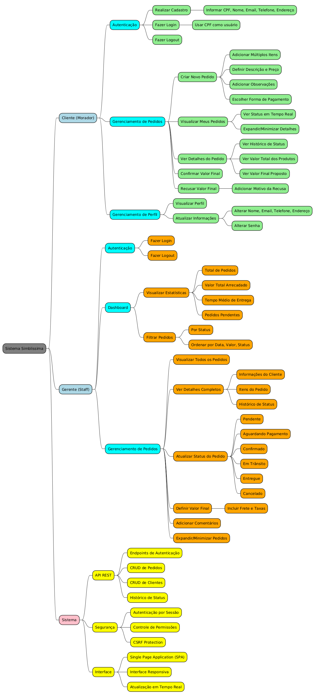

 
## Introdução
 

Mapa mental consiste em criar resumos cheios de símbolos, cores, setas e frases de efeito com o objetivo de organizar o conteúdo e facilitar associações entre as informações destacadas. Este documento apresenta o mapa mental do sistema Simblissima, que visa facilitar a logística de entregas de produtos do continente para a Ilha Primeira, organizando visualmente os principais atores, funcionalidades e componentes do sistema.

 
## Metodologia
 

O mapa mental foi desenvolvido utilizando PlantUML com sintaxe de mindmap, organizando hierarquicamente as funcionalidades e responsabilidades do sistema Simblissima. A estrutura foi criada com base nos requisitos elicitados através das técnicas de brainstorming, entrevistas e análise do documento de visão, representando as três principais entidades do sistema: Cliente (Morador), Gerente (Staff) e Sistema.

 
## Mapa Mental - Sistema Simblissima
 
### Versão 1.0

Você também pode visualizar o mapa mental interativamente aqui:
[Visualizar no PlantUML Web](http://www.plantuml.com/plantuml/uml/ZP91IyGm48Nl-HN3xkUpUfF7opR4WGqA0aKlasPLYPAslAtsT0kY6KQmB1NlVdwWjbwX5STEsCoI30pCrCdcNdScLq5JukImcVyDizYg8enBm-WuNKflj0jhEuwD4dtNs_nRnzQSjeV7TlBFV3AZIRB0J8HGyYOGRWO0v8G0beKvSogWHU5z2H_kTwjwq5Jh3W6FbWfdAozLE_aEPcTlxykAy_ZHsWG0Id6u0XUhB9ry0F0pOD3dVtSRG0JO3wANMnz8WAI2Ca2psgbzEELRLNMY1nd4j482IP7zfLxt8K5zZdx-mTDxw2niqh1wQbMC_TX5txFwDplNRXI4SSfYN3T6kUab5tvHmtoGdNYnE2Uj25hSBgYKn4W_PbmPy8YlUaGgX2HjLczkYzLxiZ3LNS8wcNmcK7s8Jh594OsaTxKsxGi0)
 
#### Estrutura do Mapa Mental

O mapa mental do sistema Simblissima foi organizado em três principais ramificações, cada uma representando os diferentes atores e componentes do sistema:

**1. Cliente (Morador da Ilha Primeira)**
- **Autenticação**: Funcionalidades de cadastro, login e logout
  - Realizar cadastro com CPF, nome, email, telefone e endereço
  - Login utilizando CPF como nome de usuário
  - Sistema de logout seguro

- **Gerenciamento de Pedidos**: Funcionalidades principais do cliente
  - Criar novos pedidos com múltiplos itens
  - Definir descrição e preço para cada item
  - Adicionar observações e escolher forma de pagamento
  - Visualizar pedidos com status em tempo real
  - Ver detalhes completos incluindo histórico de status
  - Confirmar ou recusar valores finais propostos

- **Gerenciamento de Perfil**: Manutenção de dados pessoais
  - Visualizar informações do perfil
  - Atualizar dados pessoais (nome, email, telefone, endereço)
  - Alterar senha de acesso

**2. Gerente (Staff/Administrador)**
- **Autenticação**: Sistema de login administrativo
  - Login e logout com permissões especiais

- **Dashboard**: Painel de controle gerencial
  - Visualizar estatísticas (total de pedidos, valor arrecadado, tempo médio)
  - Filtrar pedidos por status e ordenar por diferentes critérios
  - Monitorar pedidos pendentes

- **Gerenciamento de Pedidos**: Controle completo dos pedidos
  - Visualizar todos os pedidos do sistema
  - Acessar detalhes completos (cliente, itens, histórico)
  - Atualizar status (Pendente, Aguardando Pagamento, Confirmado, Em Trânsito, Entregue, Cancelado)
  - Definir valores finais incluindo frete e taxas
  - Adicionar comentários ao histórico

**3. Sistema (Componentes Técnicos)**
- **API REST**: Interface de comunicação
  - Endpoints de autenticação
  - CRUD completo para pedidos e clientes
  - Gerenciamento de histórico de status

- **Segurança**: Proteções e controles
  - Autenticação por sessão
  - Controle de permissões baseado em roles
  - Proteção CSRF contra ataques

- **Interface**: Camada de apresentação
  - Single Page Application (SPA)
  - Interface responsiva para diferentes dispositivos
  - Atualização de dados em tempo real

#### Arquivo PlantUML

O mapa mental foi implementado em PlantUML e pode ser encontrado no arquivo <code>mm.wsd</code> na pasta de iniciação. Para visualizar o mapa mental, utilize um renderizador PlantUML ou ferramentas compatíveis.

 
## Conclusão
 

O mapa mental do sistema Simblissima oferece uma visão estruturada e hierárquica de todas as funcionalidades e componentes do sistema de gerenciamento de pedidos para a Ilha Primeira. A organização visual facilita a compreensão das responsabilidades de cada ator (Cliente e Gerente) e dos componentes técnicos do sistema.

A estrutura do mapa mental reflete fielmente os requisitos funcionais elicitados durante as fases de iniciação do projeto, servindo como uma ferramenta de referência rápida para desenvolvedores, stakeholders e usuários finais. A utilização de cores diferenciadas para cada categoria (azul para usuários, amarelo para sistema, verde e laranja para funcionalidades) auxilia na identificação visual dos diferentes aspectos do sistema.

Este mapa mental demonstra a completude funcional do sistema Simblissima, abrangendo desde funcionalidades básicas de autenticação até recursos avançados de gerenciamento de pedidos e dashboard administrativo.

 
## Referências

> PlantUML Mind Map. Disponível em: https://plantuml.com/mindmap-diagram. Acesso em: 04 jun. 2025.
 
> BUZAN, Tony. Mapas Mentais e sua Elaboração: um sistema definitivo de pensamento que transformará a sua vida. São Paulo: Cultrix, 2005.
 
> Mind Mapping: Scientific Research and Studies. Disponível em: https://www.mindmeister.com/blog/mind-map-uses/. Acesso em: 04 jun. 2025.
 
## Versionamento
| Data | Versão | Descrição | Autor(es) |
| -- | -- | -- | -- |
| 24/03/2025 | 1.0 | Criação do documento e mapa mental inicial | Bernardo Lobo, Bernardo Moreira, Guilherme Dias, Julia Curto e Michel de Melo |
| 04/06/2025 | 2.0 | Atualização completa para refletir o mapa mental implementado em PlantUML (mm.wsd) do projeto Simblissima | Bernardo Lobo, Bernardo Moreira, Guilherme Dias, Julia Curto e Michel de Melo |
