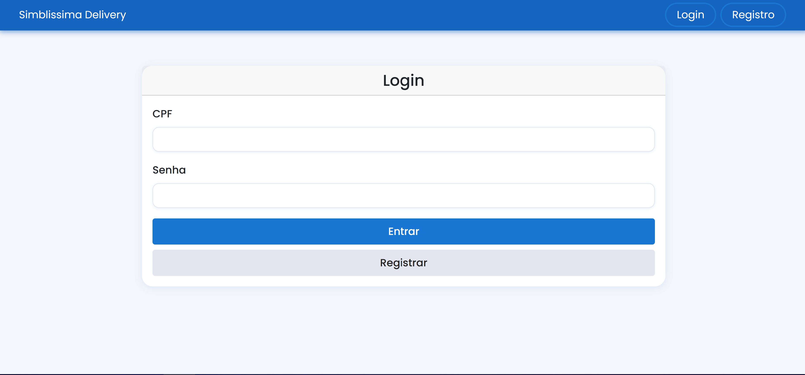
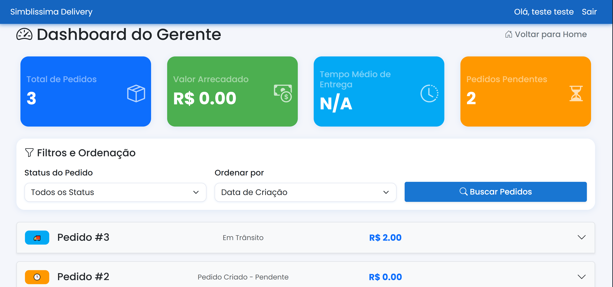
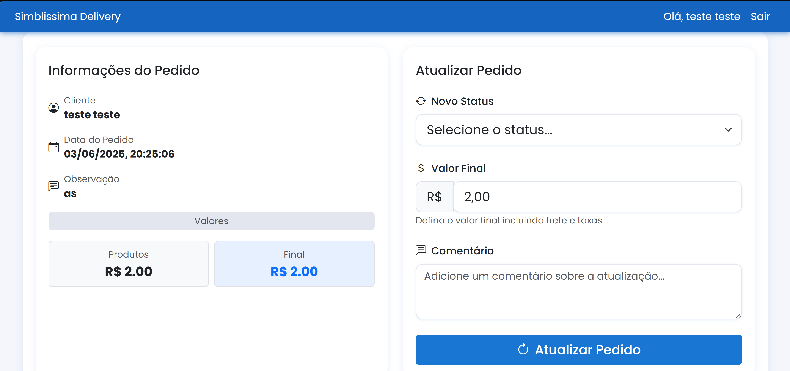

## Introdução
 

A construção do protótipo de alta fidelidade auxilia a equipe de desenvolvimento a encontrar um nível de detalhes abrangentes, extrair funcionalidades, testar usabilidade, e também fornece uma base para o gerenciamento do projeto pois com o protótipo é possível realizar estimativas de quanto tempo será necessário desempenhar em cada funcionalidade.

 
## Metodologia
 

Iniciamos o projeto através dos levantamentos iniciais da equipe, após discussões a ferramenta Figma foi selecionada para produzir o protótipo de alta fidelidade com auxílio do Material Design Color Tool.

 
## Protótipo de alta fidelidade
 
### Versão 1.0
 
### Tela Login

 
### Tela Cadastro
 

 
### Tela da Home usuário

 
### Tela da Home adm

 
### Tela Perfil

 
### Tela Dashboard

### Tela do produto no Dashboard 

 
### Tela novo pedido
 

 
### Tela meus pedidos

 
### Tela Django admin

 
### Tela da api

 
link para o <a href="https://www.figma.com/design/Je0JMpAzS7SsLFunWJ7Xmo/BACKEND?node-id=0-1&t=7InLmUGGgfVfj7OJ-1">Protótipo</a>
 
## Conclusão
 

A partir da elaboração do protótipo foi possível ter uma noção inicial da interface do usuário, definindo fluxo, paleta de cores, botões, app bars e diversas outras funcionalidades

 
## Referências
 
> Ferramenta Figma. Disponível em https://www.figma.com
 
## Autor(es)
 
| Data | Versão | Descrição | Autor(es) |
| -- | -- | -- | -- |
| 04/06/25 | 1.0 | Criação do documento | Bernardo Lobo, Bernardo Moreira, Guilherme Dias, Julia Curto e Michel de Melo |

